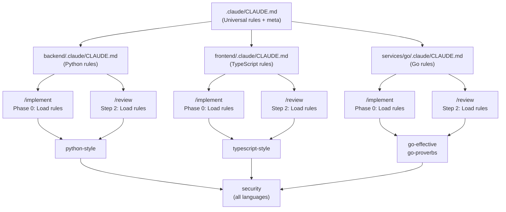
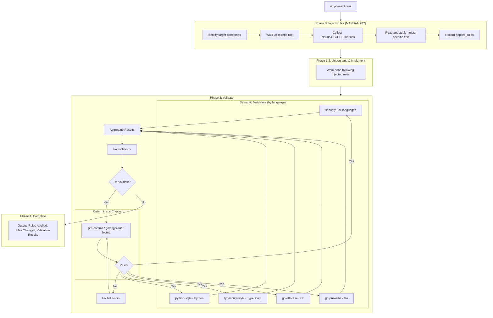
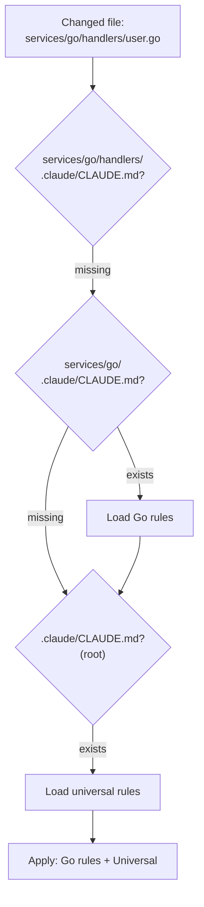
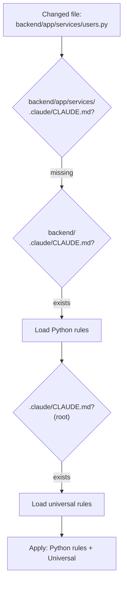
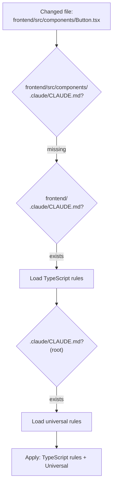

# Architecture

This document explains the design decisions behind claude-config.

## The Problem

CLAUDE.md rules are **guidance** - they can be ignored or forgotten by the LLM. We needed:

1. Rules that are **mechanically injected**, not hoped-for
2. Validation that **verifies compliance**, not trusts it
3. A system that works for **monorepos with multiple languages**

## Core Principles

### 1. Validators are authoritative, not CLAUDE.md

CLAUDE.md provides guidance. Validators **enforce** rules.

If there's a conflict between what CLAUDE.md says and what a validator checks, the validator wins. This removes ambiguity.

### 2. Rules are injected, not remembered

`/implement` and `/review` **mechanically read** applicable CLAUDE.md files before doing any work. This is Phase 0 / Step 2 - it happens first, explicitly, and is recorded.

> **Critical**: Phase 0 (rule injection) is mandatory. It must complete before any other phase. This is the single most important design decision - it eliminates reliance on LLM memory.

The LLM doesn't need to "remember" rules - they're injected fresh every time.

### 3. Deterministic before semantic

Linters run first. If they fail, stop. Only then do semantic validators run.

This ensures validator signal quality - they're not wasting time on formatting issues.

### 4. Validators have contracts

Each validator declares:
- What it checks (scope)
- What it doesn't check (excludes)
- What it assumes ran before it (assumes)

This prevents overlap and makes maintenance clear.

## Monorepo Structure



## System Flow



## Rule Injection Detail

Rule injection walks up from the changed file to the repo root, collecting `.claude/CLAUDE.md` files. Most specific rules take precedence.

### Go Example



### Python Example



### TypeScript Example



## Validator Contracts

Each validator has a `contract.json` defining its scope:

| Validator | Language | Scope | Excludes | Assumes |
|-----------|----------|-------|----------|---------|
| **go-effective** | Go | Naming, Error handling, Interface design, Control flow | Security, Go Proverbs, Formatting | gofmt, golangci-lint |
| **go-proverbs** | Go | Idiomatic Go philosophy, Concurrency patterns, Abstraction | Security, Effective Go details, Formatting | golangci-lint |
| **python-style** | Python | Google docstrings, Type hints, Error handling, Layered architecture | Security, Performance | ruff, ty/mypy, pre-commit |
| **typescript-style** | TypeScript | Strict mode, React patterns, Hooks usage, State management | Security, Performance | biome, pre-commit |
| **security** | All | Secrets, Injection, Path traversal, Auth gaps | Code style, Language idioms, Performance | (none) |

**HARD vs SHOULD by validator:**

| Validator | HARD Rules | SHOULD Rules |
|-----------|------------|--------------|
| **go-effective** | Doc comments, Error return position, No pointer-to-interface | Interface size, Early returns, Parameter count |
| **go-proverbs** | Share memory by communicating, Errors are values, Handle errors gracefully | Interface size, Zero value, Clear vs clever |
| **python-style** | Exception chaining with `from e`, No bare `except:` | Google docstrings, Modern type hints (`str \| None`) |
| **typescript-style** | Strict mode enabled, Functional components only | Proper hook dependencies, TanStack Query for server state |
| **security** | Secrets, Injection, Path traversal, Auth gaps | Insecure configurations |

This prevents:
- Validators reporting on the same thing (noise)
- Validators assuming work that didn't happen
- Scope creep over time

## Severity Model

All validators use the same unified schema:

| Level | Meaning | Action |
|-------|---------|--------|
| **HARD** | Must fix | Blocks completion |
| **SHOULD** | Fix or justify | Requires explicit justification |
| **WARN** | Advisory | Note in output, don't block |

This is intentionally simple. More levels create ambiguity.

## Example Output

```json
{
  "validator": "go-effective",
  "applied_rules": [
    "backend/.claude/CLAUDE.md",
    ".claude/CLAUDE.md"
  ],
  "files_checked": [
    "backend/app/handlers/user.go",
    "backend/app/handlers/user_test.go"
  ],
  "pass": false,
  "hard_violations": [
    {
      "rule": "Exported identifiers MUST have doc comments",
      "location": "user.go:45",
      "explanation": "Function CreateUser is exported but has no doc comment"
    }
  ],
  "should_violations": [
    {
      "rule": "Functions SHOULD do one thing",
      "location": "user.go:78",
      "justification_required": true
    }
  ],
  "warnings": [
    {
      "rule": "Overly complex functions",
      "location": "user.go:120",
      "note": "Consider breaking into smaller functions"
    }
  ],
  "summary": {
    "hard_count": 1,
    "should_count": 1,
    "warning_count": 1
  }
}
```

## Why This Works

| Failure Mode | How We Prevent It |
|--------------|-------------------|
| LLM forgets rules | Rules are mechanically injected in Phase 0 |
| Rules not applied | Output includes "Rules Applied" - observable |
| Validators overlap | Contracts declare scope/excludes |
| Validation skipped | `/implement` won't complete until validation passes |
| Silent failures | Validators echo `applied_rules` in JSON output |

## Edge Cases

| Scenario | Handling |
|----------|----------|
| First commit / no HEAD~1 | Fall back to staged files, then unstaged |
| Detached HEAD | Use `--diff-filter=ACMRT` to detect changes |
| >50 files changed | Process in batches |
| Conflicting rules | Prefer more specific rule, note conflict |
| New directories created during implementation | Re-run Phase 0 before validation |

## Meta-rule (fallback only)

The root CLAUDE.md contains a meta-rule telling Claude to read subdirectory rules. This is a **fallback** for ad-hoc interactions, not the primary mechanism.

For `/implement` and `/review`, rule injection is mechanical and explicit. The meta-rule exists for:
- Manual Claude interactions
- Documentation of intent
- Edge cases where someone bypasses the workflow

It is **not** on the critical path.

## Validators

| Validator | Language | Status |
|-----------|----------|--------|
| go-effective | Go | ✅ Done |
| go-proverbs | Go | ✅ Done |
| python-style | Python | ✅ Done |
| typescript-style | TypeScript | ✅ Done |
| security | All | ✅ Done |
