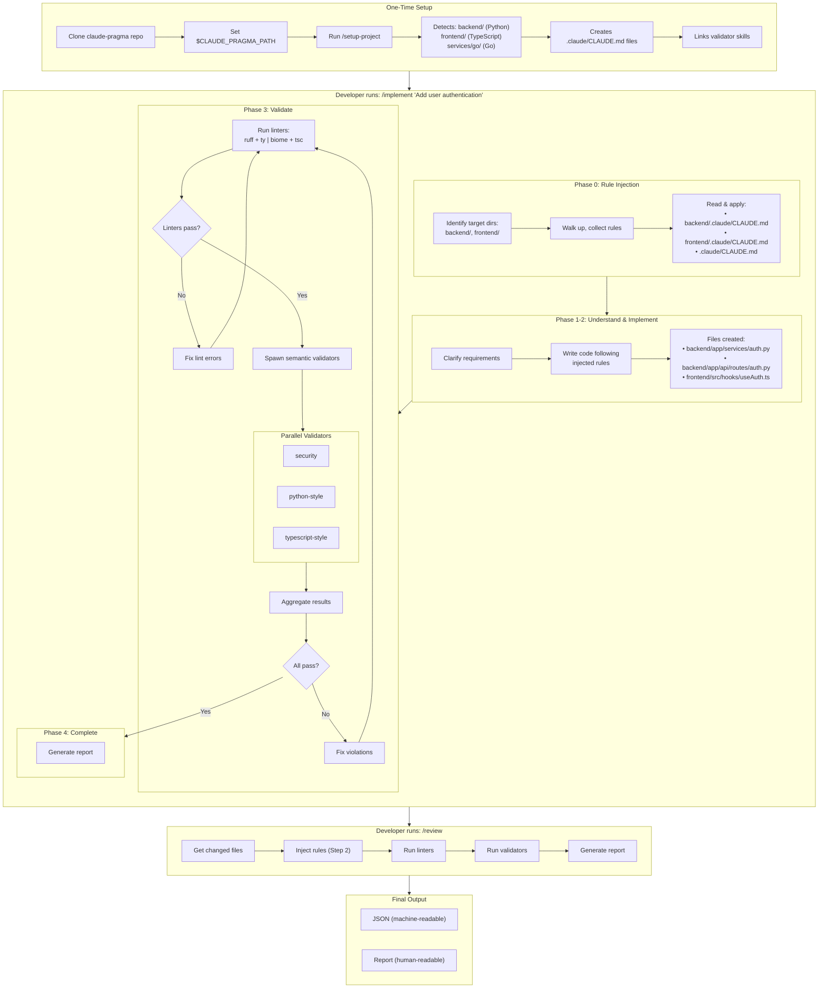
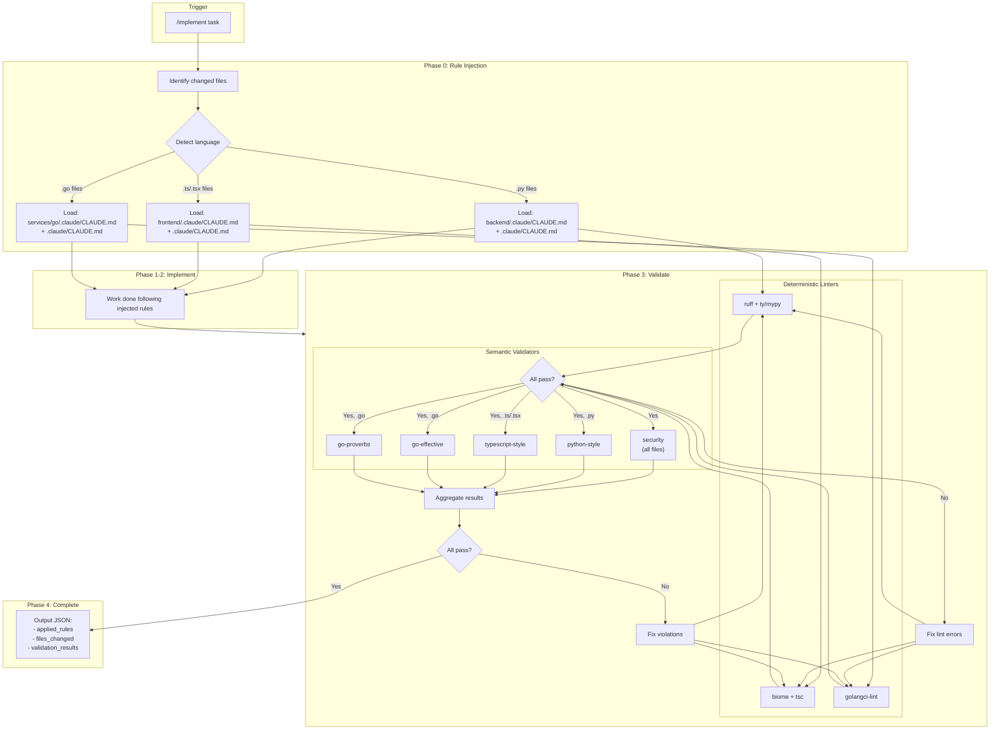
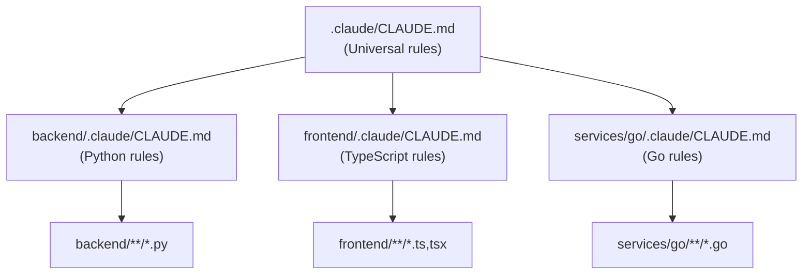
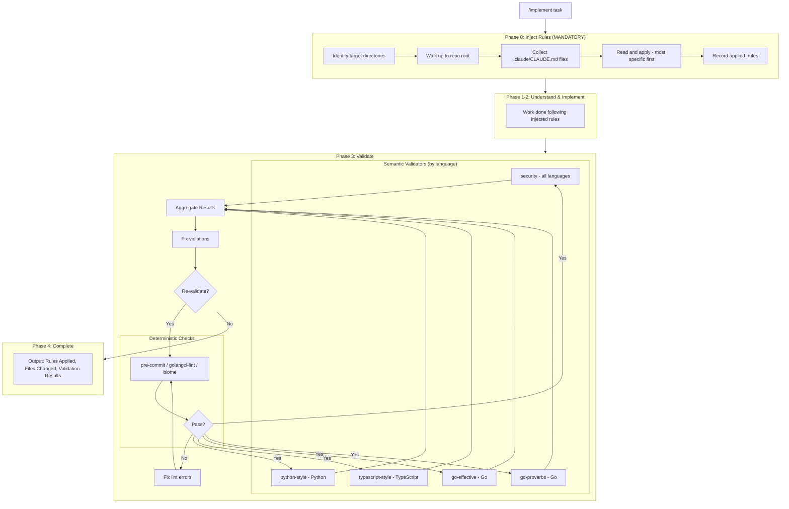
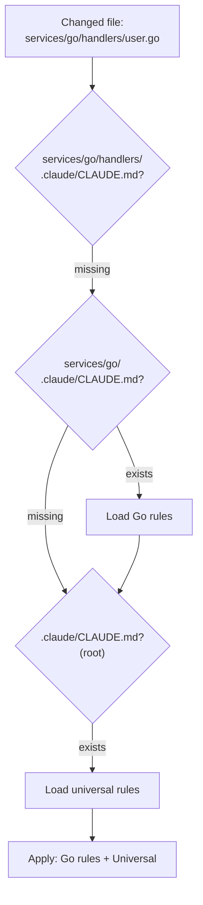
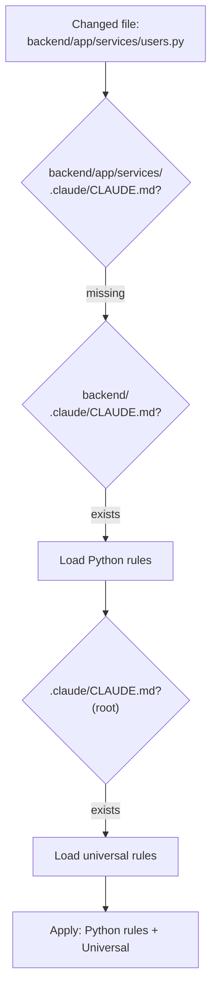
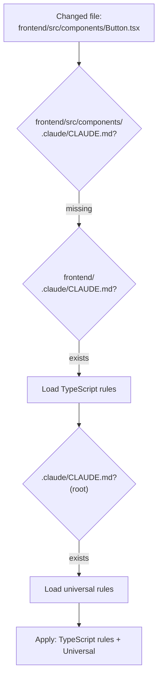
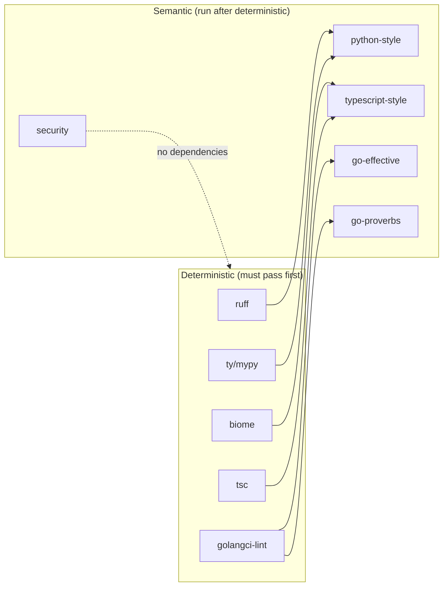
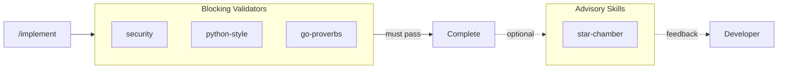

# Architecture

This document explains the design decisions behind claude-pragma.

## User Flow: End-to-End

This diagram shows the complete workflow from project setup through implementation and review.



## Output Examples

After `/implement` or `/review`, you get both formats:

### Human-Readable Report

```
## Implementation Complete

**Task:** Add user authentication

**Rules Applied:**
- backend/.claude/CLAUDE.md (Python)
- frontend/.claude/CLAUDE.md (TypeScript)
- .claude/CLAUDE.md (Universal)

**Files Changed:**
- backend/app/services/auth.py: AuthService with login/logout
- backend/app/api/routes/auth.py: POST /login, POST /logout endpoints
- frontend/src/hooks/useAuth.ts: useAuth hook with TanStack Query

**Validation:**
| Validator        | Status | Hard | Should | Warn |
|------------------|--------|------|--------|------|
| security         | ✓ Pass | 0    | 0      | 1    |
| python-style     | ✓ Pass | 0    | 0      | 0    |
| typescript-style | ✓ Pass | 0    | 0      | 0    |

**Warnings:**
- security: auth.py:45 - Consider adding rate limiting (advisory)

Ready for /review or commit.
```

### JSON Output (for tooling)

```json
{
  "task": "Add user authentication",
  "applied_rules": [
    "backend/.claude/CLAUDE.md",
    "frontend/.claude/CLAUDE.md",
    ".claude/CLAUDE.md"
  ],
  "rule_conflicts": [],
  "files_changed": [
    "backend/app/services/auth.py",
    "backend/app/api/routes/auth.py",
    "frontend/src/hooks/useAuth.ts"
  ],
  "validation": {
    "pass": true,
    "validators": [
      {"name": "security", "pass": true, "hard": 0, "should": 0, "warn": 1},
      {"name": "python-style", "pass": true, "hard": 0, "should": 0, "warn": 0},
      {"name": "typescript-style", "pass": true, "hard": 0, "should": 0, "warn": 0}
    ],
    "total": {"hard": 0, "should": 0, "warn": 1}
  },
  "warnings": [
    {
      "validator": "security",
      "location": "auth.py:45",
      "note": "Consider adding rate limiting"
    }
  ]
}
```

---

## The Problem

CLAUDE.md rules are **guidance** - they can be ignored or forgotten by the LLM. We needed:

1. Rules that are **mechanically injected**, not hoped-for
2. Validation that **verifies compliance**, not trusts it
3. A system that works for **monorepos with multiple languages**

## Core Principles

### 1. Validators are authoritative, not CLAUDE.md

CLAUDE.md provides guidance. Validators **enforce** rules.

If there's a conflict between what CLAUDE.md says and what a validator checks, the validator wins. This removes ambiguity.

### 2. Rules are injected, not remembered

`/implement` and `/review` **mechanically read** applicable CLAUDE.md files before doing any work. This is Phase 0 / Step 2 - it happens first, explicitly, and is recorded.

> **Critical**: Phase 0 (rule injection) is mandatory. It must complete before any other phase. This is the single most important design decision - it eliminates reliance on LLM memory.

The LLM doesn't need to "remember" rules - they're injected fresh every time.

### 3. Deterministic before semantic

Linters run first. If they fail, stop. Only then do semantic validators run.

This ensures validator signal quality - they're not wasting time on formatting issues.

### 4. Validators have contracts

Each validator declares:
- What it checks (scope)
- What it doesn't check (excludes)
- What it assumes ran before it (assumes)

This prevents overlap and makes maintenance clear.

## Monorepo Validator Map

This diagram shows the complete flow for a multi-language monorepo from `/implement` through validation.



## Monorepo Directory Structure



## System Flow



## Rule Injection Detail

Rule injection walks up from the changed file to the repo root, collecting `.claude/CLAUDE.md` files. Most specific rules take precedence.

### Go Example



### Python Example



### TypeScript Example



## Validator Contracts

Each validator has a `contract.json` defining its scope:

| Validator | Language | Scope | Excludes | Assumes |
|-----------|----------|-------|----------|---------|
| **go-effective** | Go | Naming, Error handling, Interface design, Control flow | Security, Go Proverbs, Formatting | gofmt, golangci-lint |
| **go-proverbs** | Go | Idiomatic Go philosophy, Concurrency patterns, Abstraction | Security, Effective Go details, Formatting | golangci-lint |
| **python-style** | Python | Google docstrings, Type hints, Error handling, Layered architecture | Security, Performance | ruff, ty/mypy, pre-commit |
| **typescript-style** | TypeScript | Strict mode, React patterns, Hooks usage, State management | Security, Performance | biome, pre-commit |
| **security** | All | Secrets, Injection, Path traversal, Auth gaps | Code style, Language idioms, Performance | (none) |

### Validator Dependency Chain

Semantic validators assume deterministic linters have passed. This is enforced by Phase 3 ordering.



**HARD vs SHOULD by validator:**

| Validator | HARD Rules | SHOULD Rules |
|-----------|------------|--------------|
| **go-effective** | Doc comments, Error return position, No pointer-to-interface | Interface size, Early returns, Parameter count |
| **go-proverbs** | Share memory by communicating, Errors are values, Handle errors gracefully | Interface size, Zero value, Clear vs clever |
| **python-style** | Exception chaining with `from e`, No bare `except:` | Google docstrings, Modern type hints (`str \| None`) |
| **typescript-style** | Strict mode enabled, Functional components only | Proper hook dependencies, TanStack Query for server state |
| **security** | Secrets, Injection, Path traversal, Auth gaps | Insecure configurations |

This prevents:
- Validators reporting on the same thing (noise)
- Validators assuming work that didn't happen
- Scope creep over time

## Severity Model

All validators use the same unified schema:

| Level | Meaning | Action |
|-------|---------|--------|
| **HARD** | Must fix | Blocks completion |
| **SHOULD** | Fix or justify | Requires explicit justification |
| **WARN** | Advisory | Note in output, don't block |

This is intentionally simple. More levels create ambiguity.

## Example Output

### Single Validator Output

Each validator produces JSON in this schema:

```json
{
  "validator": "python-style",
  "applied_rules": [
    "backend/.claude/CLAUDE.md",
    ".claude/CLAUDE.md"
  ],
  "files_checked": ["backend/app/services/users.py"],
  "pass": false,
  "hard_violations": [
    {
      "rule": "Exception chaining required",
      "location": "users.py:45",
      "explanation": "raise UserNotFoundError() should use 'from e'"
    }
  ],
  "should_violations": [],
  "warnings": [],
  "summary": { "hard_count": 1, "should_count": 0, "warning_count": 0 }
}
```

### Aggregated Output (Phase 4)

Phase 4 combines all validator results into a single output:

```json
{
  "task": "implement user authentication",
  "applied_rules": [
    "backend/.claude/CLAUDE.md",
    "frontend/.claude/CLAUDE.md",
    ".claude/CLAUDE.md"
  ],
  "rule_conflicts": [],
  "files_changed": [
    "backend/app/services/auth.py",
    "backend/app/api/routes/auth.py",
    "frontend/src/hooks/useAuth.ts"
  ],
  "validation": {
    "pass": false,
    "validators": [
      {
        "name": "security",
        "pass": true,
        "hard_count": 0,
        "should_count": 0,
        "warning_count": 1
      },
      {
        "name": "python-style",
        "pass": false,
        "hard_count": 1,
        "should_count": 0,
        "warning_count": 0
      },
      {
        "name": "typescript-style",
        "pass": true,
        "hard_count": 0,
        "should_count": 0,
        "warning_count": 0
      }
    ],
    "total": {
      "hard_count": 1,
      "should_count": 0,
      "warning_count": 1
    }
  },
  "blocking_violations": [
    {
      "validator": "python-style",
      "rule": "Exception chaining required",
      "location": "auth.py:67",
      "explanation": "raise AuthenticationError() should use 'from e'"
    }
  ]
}
```

## Why This Works

| Failure Mode | How We Prevent It |
|--------------|-------------------|
| LLM forgets rules | Rules are mechanically injected in Phase 0 |
| Rules not applied | Output includes "Rules Applied" - observable |
| Validators overlap | Contracts declare scope/excludes |
| Validation skipped | `/implement` won't complete until validation passes |
| Silent failures | Validators echo `applied_rules` in JSON output |

## Edge Cases

| Scenario | Handling |
|----------|----------|
| First commit / no HEAD~1 | Fall back to staged files, then unstaged |
| Detached HEAD | Use `--diff-filter=ACMRT` to detect changes |
| >50 files changed | Process in batches of 50, note batch number |
| Conflicting rules | Prefer more specific rule, log in `rule_conflicts` array |
| New directories created during implementation | Re-run Phase 0 before validation |

### Rule Conflict Logging

When rules conflict (e.g., subdirectory rule contradicts root rule), the conflict is logged for auditability:

```json
{
  "rule_conflicts": [
    {
      "rule": "line-length",
      "root_value": 80,
      "override_value": 120,
      "source": "backend/.claude/CLAUDE.md",
      "resolution": "Used override (more specific)"
    }
  ]
}
```

The more specific rule always wins, but the conflict is recorded so it can be reviewed.

## Meta-rule (fallback only)

The root CLAUDE.md contains a meta-rule telling Claude to read subdirectory rules. This is a **fallback** for ad-hoc interactions, not the primary mechanism.

For `/implement` and `/review`, rule injection is mechanical and explicit. The meta-rule exists for:
- Manual Claude interactions
- Documentation of intent
- Edge cases where someone bypasses the workflow

It is **not** on the critical path.

## Validators

| Validator | Language | Status |
|-----------|----------|--------|
| go-effective | Go | ✅ Done |
| go-proverbs | Go | ✅ Done |
| python-style | Python | ✅ Done |
| typescript-style | TypeScript | ✅ Done |
| security | All | ✅ Done |

---

## Advisory Skills

Advisory skills provide optional, non-blocking feedback. Unlike validators, they don't gate commits or deployments - they offer additional perspectives and insights.

### Star-Chamber: Multi-LLM Craftsmanship Council

The `/star-chamber` skill fans out code reviews to multiple LLM providers (Claude, OpenAI, Gemini, etc.) and aggregates their feedback into consensus recommendations.

**Key characteristics:**
- Advisory only (doesn't block like validators)
- Uses `any-llm-sdk` via `uv run` (no global Python install needed)
- Supports parallel and sequential review modes

**Execution modes:**
| Mode | Invocation | Description |
|------|------------|-------------|
| Parallel | (default) | Independent calls to all providers simultaneously |
| Debate | `/star-chamber --debate --rounds N` | Multiple rounds with anonymous synthesis between rounds |

**Debate mode** uses [Chatham House rules](https://www.chathamhouse.org/about-us/chatham-house-rule) for inter-round summarization: feedback from each round is synthesized by content themes without attributing points to specific providers. This encourages engagement with ideas rather than sources, and reduces bias from provider reputation.

**Integration:**


**Output:**
- Markdown report with consensus/majority/individual issues
- JSON for tooling integration
- Quality ratings per provider

**Cost consideration:** Each invocation calls all configured providers (~$0.02-0.10 per run). Use intentionally, not automatically.
