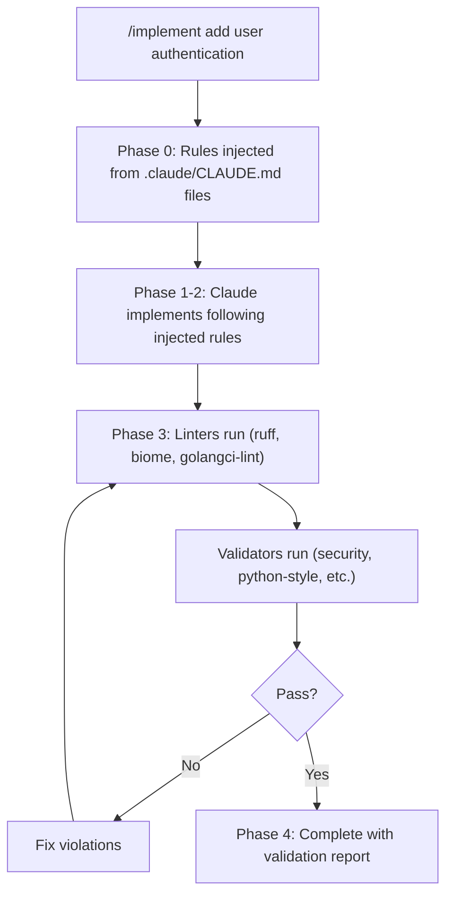

# Claude Pragma

**The problem:** Claude Code follows CLAUDE.md rules inconsistently. Rules get forgotten mid-conversation, ignored during complex tasks, or applied partially. There's no enforcement mechanism.

**The solution:** claude-pragma provides skills that mechanically inject rules and validate compliance. Rules aren't remembered - they're enforced by validators that run automatically on every implementation.

## How It Works



**Key principle:** Validators are authoritative, not CLAUDE.md. If there's a conflict, the validator wins.

## Prerequisites

- [Claude Code](https://docs.anthropic.com/en/docs/claude-code) CLI installed
- Git
- [uv](https://docs.astral.sh/uv/) (for Python-based validators and star-chamber)

## Quick Start

```bash
# Install the plugin from the marketplace
/plugin marketplace add peteski22/claude-pragma
/plugin install pragma@claude-pragma

# Then in any project:
/setup-project
```

> **Note:** Skills are shown as `/star-chamber (pragma)` in the CLI autocomplete. The short form `/star-chamber` is the easiest way to invoke them. The fully-qualified form `/pragma:star-chamber` also works.

### Example: Using /implement

```bash
> /implement add input validation to the login form

[Phase 0] Injecting rules from:
  - .claude/CLAUDE.md (universal)
  - frontend/.claude/CLAUDE.md (typescript)

[Phase 1-2] Implementing...
  Created: frontend/src/utils/validation.ts
  Modified: frontend/src/components/LoginForm.tsx

[Phase 3] Validating...
  ✓ biome: passed
  ✓ tsc: passed
  ✓ security: passed
  ✓ typescript-style: passed

[Phase 4] Complete
  Files changed: 2
  Validators run: 4
  Issues: 0
```

## Skills

### Universal Skills

| Skill | What it does | Why it matters |
|-------|--------------|----------------|
| `/setup-project` | Detects languages, creates CLAUDE.md files, configures validators | One command to configure any project |
| `/implement <task>` | Implements with automatic validation loop | Catches issues before you review the code |
| `/review` | Validates current changes against all rules | Quick check before committing |

### Validators

Validators are semantic checks that run after linters pass. They enforce language-specific best practices.

| Skill | Language | What it checks |
|-------|----------|----------------|
| `/validate` | All | Orchestrator - runs all applicable validators |
| `/security` | All | Secrets, injection vulnerabilities, path traversal, auth gaps |
| `/python-style` | Python | Google docstrings, type hints, exception chaining, layered architecture |
| `/typescript-style` | TypeScript | Strict mode, React patterns, proper hooks, state management |
| `/go-effective` | Go | Effective Go rules - naming, error handling, interface design |
| `/go-proverbs` | Go | Go Proverbs - idiomatic patterns, concurrency, "clear is better than clever" |

### Advisory Skills

Advisory skills provide feedback but don't block completion.

| Skill | What it does |
|-------|--------------|
| `/star-chamber` | Fans out code review to multiple LLMs (OpenAI, Anthropic, Gemini) and aggregates consensus feedback |

## Validator Severity Levels

| Level | Meaning | What happens |
|-------|---------|--------------|
| **HARD** | Must fix | Blocks `/implement` completion |
| **SHOULD** | Fix or justify | Requires explicit justification to proceed |
| **WARN** | Advisory | Noted in output but doesn't block |

## Environment Variables

| Variable | Required | Description |
|----------|----------|-------------|
| `STAR_CHAMBER_CONFIG` | No | Custom path to star-chamber config (default: `~/.config/star-chamber/providers.json`) |
| `ANY_LLM_KEY` | For `/star-chamber` | Platform key from [any-llm.ai](https://any-llm.ai) |
| `OPENAI_API_KEY` | For `/star-chamber` | OpenAI API key (if not using any-llm.ai) |
| `ANTHROPIC_API_KEY` | For `/star-chamber` | Anthropic API key (if not using any-llm.ai) |
| `GEMINI_API_KEY` | For `/star-chamber` | Google Gemini API key (if not using any-llm.ai) |

## Monorepo Support

`/setup-project` detects languages at root AND in subdirectories, creating appropriate CLAUDE.md files for each:

```text
myproject/
├── .claude/
│   └── CLAUDE.md               # Universal rules (commit this)
├── CLAUDE.local.md             # Personal supplements (gitignored)
├── backend/
│   ├── .claude/CLAUDE.md       # Python-specific rules
│   └── pyproject.toml
└── frontend/
    ├── .claude/CLAUDE.md       # TypeScript-specific rules
    └── package.json
```

When you edit `backend/app/main.py`, both the Python rules and universal rules are injected. If `CLAUDE.local.md` exists at the project root, it is auto-loaded by Claude Code as per-user supplements.

## Directory Structure

```text
claude-pragma/
├── .claude-plugin/
│   └── marketplace.json        # Marketplace catalog
├── plugins/
│   └── pragma/                 # The plugin
│       ├── .claude-plugin/
│       │   └── plugin.json     # Plugin manifest
│       ├── agents/             # Custom subagents (security, star-chamber)
│       ├── skills/             # All skills (implement, review, validate, etc.)
│       ├── claude-md/
│       │   ├── universal/      # Universal rules for all projects
│       │   └── languages/      # Language-specific rules (go, python, typescript)
│       ├── reference/          # Template configs (golangci-lint, providers.json)
│       └── tools/              # go-structural deterministic linter
├── ARCHITECTURE.md
└── README.md
```

## Version Control

**Commit** the generated `.claude/CLAUDE.md` files so other developers get the same rules without re-running `/setup-project`.

Claude Code adds `CLAUDE.local.md` to `.gitignore` automatically when it creates the file. If you create it manually, verify it is in your `.gitignore` to avoid committing personal rules.

In git worktrees, use `@import` (a Claude Code directive that includes another CLAUDE.md file) in `CLAUDE.local.md` to reference a shared local rules file rather than duplicating it per worktree:

```markdown
@import ../shared-local-rules.md
```

## Legacy Installation (Deprecated)

The previous `make install` + `$CLAUDE_PRAGMA_PATH` approach is deprecated. Use the plugin marketplace instead. If migrating, remove the old symlinks and env var:

```bash
make uninstall
# Remove CLAUDE_PRAGMA_PATH from your shell profile
```

## More Information

- [ARCHITECTURE.md](ARCHITECTURE.md) - Design decisions, validator contracts, system flow diagrams
- [Issues](https://github.com/peteski22/claude-pragma/issues) - Bug reports and feature requests

## License

Apache 2.0 - See [LICENSE](LICENSE) for details.
